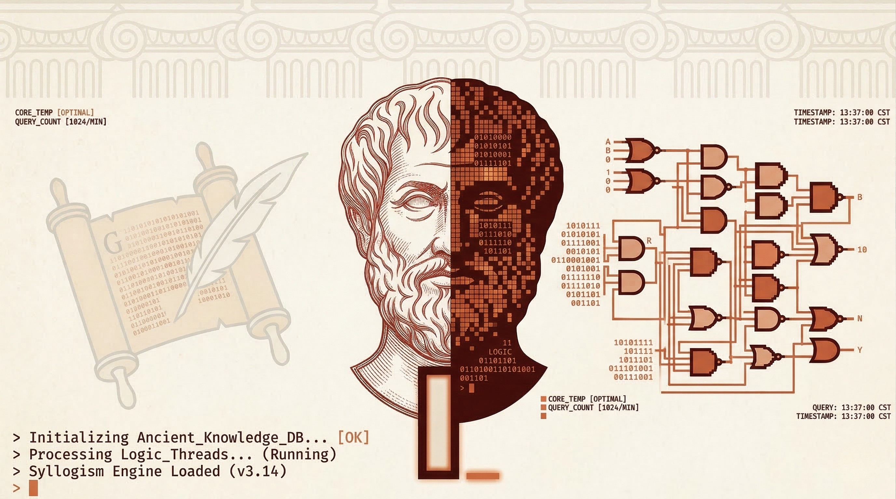

<p align="center">
  
</p>

# Claudistotle — Philosophy Research Plugin for Claude Code

<p align="center">
  <a href="https://github.com/Rlin1027/claudistotle/blob/main/LICENSE"></a>
  
  
  
  
  
  
  
  
  
</p>

A full-pipeline philosophy research assistant that takes you from a rough topic idea to a polished academic paper. Claudistotle searches 8+ academic databases, produces literature reviews with verified citations (never fabricates references), writes structured academic prose, and simulates three-round peer review — all inside Claude Code.

## What It Does

```
Topic idea  →  Research design  →  Literature review  →  Draft  →  Peer review  →  Paper
```

- **Literature review**: Searches Semantic Scholar, OpenAlex, CORE, arXiv, PhilPapers, Stanford Encyclopedia, Internet Encyclopedia, and Notre Dame Philosophical Reviews. Every citation is verified against CrossRef.
- **Academic writing**: Builds an argument skeleton (claim/evidence/counterargument/rebuttal) with a logic pre-review, then expands into full prose with Chicago author-date citations.
- **Peer review simulation**: Three rounds — argument validity, evidence quality (with automated citation integrity checks), and writing quality. Two AI personas (Athena the reviewer, Calliope the reviser) iterate on your draft.
- **Text commentary**: Close reading and logical annotation of primary philosophical texts, automatically integrated into your draft.
- **Knowledge base**: Karpathy-style three-layer knowledge base (`raw/` → `wiki/` → `schema`) that accumulates research knowledge across projects. Ingest literature reviews to build structured wiki pages for philosophers, concepts, and debates. Query prior research before starting new projects to avoid redundant work.
- **Autopilot**: Runs the entire pipeline with configurable autonomy (full / moderate / cautious), self-healing on quality gate failures.

## Prerequisites

- [Claude Code](https://claude.ai/code) — CLI or Desktop app
- [uv](https://github.com/astral-sh/uv) — fast Python package manager
- Python 3.9+
- jq — required for BibTeX validation hooks (`brew install jq` / `apt install jq`)

> **Note**: Claude Code Cloud (claude.ai web) is not yet supported because its sandbox blocks the external API calls Claudistotle needs. Use the local CLI or Desktop app.

## Installation

Install at **project scope** so everyone who clones your repo gets the plugin automatically:

```bash
# Add the marketplace
/plugin marketplace add Rlin1027/claudistotle

# Install the plugin
/plugin install claudistotle@claudistotle
```

For local development or testing:

```bash
claude plugin install --plugin-dir /path/to/claudistotle-plugin --scope project
```

## First-Time Setup

Start Claude Code in your project directory and run:

```
/claudistotle:setup
```

The setup wizard guides you through environment verification, API key configuration, and workspace initialization.

### API Keys

Claudistotle needs API access to search academic databases. Create a `.env` file in your project root:

```bash
# Required
BRAVE_API_KEY=your-brave-api-key        # https://brave.com/search/api/ (free tier: 2,000 queries/month)
CROSSREF_MAILTO=your@email.com          # Your email — no signup needed

# Recommended
S2_API_KEY=your-semantic-scholar-key    # https://www.semanticscholar.org/product/api (free, 10x rate boost)
OPENALEX_EMAIL=your@email.com           # Your email — no signup needed
```

Verify your configuration:

```bash
$PYTHON $CLAUDE_PLUGIN_ROOT/skills/philosophy-research/scripts/check_setup.py --verbose
```

## Usage

### Quick Start

Tell Claude what you want to research:

```
I need a literature review on the extended mind thesis and its implications for cognitive offloading.
```

Claude invokes `/claudistotle:literature-review` and coordinates the 6-phase automated workflow. Output lands in `reviews/[your-topic]/`.

For a guided introduction, run `/claudistotle:help`.

### Research Workflow

The full pipeline follows this sequence, with quality gates between phases:

```mermaid
flowchart TD
    A["/claudistotle:research-design<br/>Define research question, scope & methodology"] --> B

    B["/claudistotle:literature-review<br/>6-phase automated search & synthesis"]
    B --> B1["Phase 1 · Environment check"]
    B1 --> B2["Phase 2 · Domain decomposition"]
    B2 --> B3["Phase 3 · Parallel domain research<br/>(8 databases × N domains)"]
    B3 --> B4["Phase 4 · Synthesis planning"]
    B4 --> B5["Phase 5 · Section writing"]
    B5 --> B6["Phase 6 · Assembly & export"]
    B6 --> C

    C{"/claudistotle:validate · Mode A<br/>Literature coverage sufficient?"}
    C -- "Pass ✅" --> D
    C -- "Fail ❌" --> B3

    D["/claudistotle:refine<br/>Re-evaluate: proceed / narrow / pivot / expand"]
    D --> E

    E["/claudistotle:draft<br/>Step 1: argument skeleton → Step 2: full prose"]
    E --> F

    F{"/claudistotle:validate · Mode B<br/>Citation integrity check"}
    F -- "Pass ✅" --> G
    F -- "Fail ❌" --> E

    G["/claudistotle:peer-review<br/>Round 1: argument → Round 2: evidence → Round 3: writing"]
    G --> H

    H{"/claudistotle:validate · Mode C<br/>Change record completeness"}
    H -- "Pass ✅" --> I
    H -- "Fail ❌" --> G

    I(["Done ✅"])

    style A fill:#4a90d9,color:#fff
    style B fill:#4a90d9,color:#fff
    style B1 fill:#6baed6,color:#fff
    style B2 fill:#6baed6,color:#fff
    style B3 fill:#6baed6,color:#fff
    style B4 fill:#6baed6,color:#fff
    style B5 fill:#6baed6,color:#fff
    style B6 fill:#6baed6,color:#fff
    style C fill:#f0ad4e,color:#333
    style D fill:#5bc0de,color:#fff
    style E fill:#4a90d9,color:#fff
    style F fill:#f0ad4e,color:#333
    style G fill:#4a90d9,color:#fff
    style H fill:#f0ad4e,color:#333
    style I fill:#5cb85c,color:#fff
```



You don't have to follow the full pipeline. Each skill works independently — run just `/claudistotle:literature-review` for a standalone literature review, or jump to `/claudistotle:draft` if you already have your research.

Side tracks available at any point:

- `/claudistotle:feedback` — Record advisor/committee feedback and route it to the right stage
- `/claudistotle:text-commentary` — Close reading of primary source texts (independent of main pipeline)
- `/claudistotle:autopilot` — Run the pipeline end-to-end with minimal human intervention

### All Commands

| Command | Description |
|---------|-------------|
| `/claudistotle:setup` | First-time configuration wizard |
| `/claudistotle:help` | Interactive usage guide and tutorial |
| `/claudistotle:research-design` | Define research question and methodology |
| `/claudistotle:literature-review` | Automated 6-phase literature review |
| `/claudistotle:text-commentary` | Primary text close reading and annotation |
| `/claudistotle:draft` | Two-step academic writing (skeleton + prose) |
| `/claudistotle:peer-review` | Three-round peer review simulation |
| `/claudistotle:refine` | Research question refinement |
| `/claudistotle:validate` | Quality gates between pipeline phases |
| `/claudistotle:feedback` | External feedback integration |
| `/claudistotle:autopilot` | Automated pipeline execution |
| `/claudistotle:knowledge` | Knowledge base management (ingest & query) |
| `/claudistotle:philosophy-research` | Direct academic database search |

### Literature Review: How It Works

The `/claudistotle:literature-review` skill coordinates 6 phases with specialized subagents:

1. **Environment check** — Verifies API keys, packages, and project structure
2. **Domain decomposition** — AI planner breaks your topic into 3-5 searchable domains
3. **Parallel research** — For each domain, a researcher agent searches all 8 databases, verifies citations via CrossRef, and downloads open-access PDFs
4. **Synthesis planning** — AI designs a coherent outline from collected literature
5. **Section writing** — Parallel writers produce each review section
6. **Assembly** — Merges sections, deduplicates bibliography, lints Markdown, optionally exports to DOCX

### Autopilot Mode

`/claudistotle:autopilot` chains the entire workflow automatically. Configure via `reviews/[project-name]/autopilot-config.md`:

| Level | Behavior |
|-------|----------|
| `cautious` | Pauses at every decision point |
| `moderate` (default) | Auto-advances routine steps, pauses at key choices |
| `full` | Runs nearly autonomously (0-1 pauses total) |

Self-healing: if a quality gate fails (e.g., literature coverage gap), autopilot automatically retries — runs a supplementary search, then re-validates (max 2 retries before asking for help).

### Knowledge Base

`/claudistotle:knowledge` manages a cross-project knowledge base inspired by [Andrej Karpathy's approach](https://x.com/karpathy/status/2039805659525644595) to LLM-maintained wikis. It uses a three-layer architecture:

- **Raw layer** (`knowledge-base/raw/`): Immutable project snapshots (BibTeX + literature review)
- **Wiki layer** (`knowledge-base/wiki/`): LLM-maintained Markdown pages for philosophers, concepts, and debates — with Obsidian-compatible wikilinks
- **Schema layer** (`knowledge-base/CLAUDE.md`): Page templates, naming conventions, and ingest rules

Two operations:

| Command | What it does |
|---------|-------------|
| `/claudistotle:knowledge ingest [project]` | Extracts entities from a completed literature review and creates/updates wiki pages (two-pass: deterministic BibTeX parsing + LLM enrichment) |
| `/claudistotle:knowledge query [topic]` | Searches the knowledge base and returns a Prior Knowledge Brief that can feed into future literature reviews |

The knowledge base grows with each project. When starting a new literature review, Phase 1.5 automatically queries existing knowledge to avoid redundant searches.

## Output Files

All outputs are saved to `reviews/[project-name]/`:

| File | Description |
|------|-------------|
| `research-proposal.md` | Research question, scope, and methodology |
| `literature-review-final.md` | Complete literature review |
| `literature-review-final.docx` | DOCX version (if pandoc installed) |
| `literature-all.bib` | Aggregated BibTeX bibliography |
| `argument-skeleton.md` | Structured argument outline |
| `paper-draft.md` | Full academic paper draft |
| `change-record.md` | Revision history from peer review |
| `commentary-*.md` | Primary text commentaries |
| `PROGRESS.md` | Progress tracker (auto-updated by all skills) |
| `INDEX.md` | Project index (auto-generated for context efficiency) |
| `reports/` | Timestamped quality reports (validation, review rounds, feedback) |
| `archive/` | Version history (auto-archived at decision points) |
| `sources/primary/` | Primary source texts (user-provided) |
| `sources/secondary/` | Secondary literature full-text (auto-downloaded PDFs) |

### Working with BibTeX

The `.bib` files are standard BibTeX and can be imported into Zotero, Mendeley, BibDesk, or used with LaTeX/pandoc. They contain rich metadata beyond what reference managers typically display — paper summaries, relevance ratings, importance scores, and abstract sources are stored in `note` and `keywords` fields. Open the files in a text editor to access this information.

## Important Notes

- **Every citation is verified.** Claudistotle checks all references against CrossRef and Semantic Scholar. If a paper can't be verified, it's flagged rather than silently included.
- **No hallucinated references.** Unlike general LLM usage, this tool never fabricates citations. BibTeX hooks validate syntax and metadata provenance before any `.bib` file is written.
- **Language matching.** All skills respond in whatever language you use. Write in Chinese, get results in Chinese. Write in English, get results in English.
- **Resume interrupted work.** If a session is interrupted, just say "continue". Claude reads `PROGRESS.md` to resume where you left off.
- **Cost considerations.** A full literature review typically costs $9-$13 in Claude API usage. Use Sonnet (type `/model` in Claude Code) for most tasks to save costs — Opus is only needed for the most complex synthesis.
- **Paywalled content.** The tool searches open databases and downloads open-access papers. It cannot access paywalled journal articles. Download important paywalled PDFs manually to `sources/secondary/`.
- **Cross-platform.** Works on macOS, Linux, and Windows (Git Bash). The SessionStart hook auto-detects the platform.

## Development

To test changes locally:

```bash
claude plugin install --plugin-dir ./claudistotle-plugin --scope project
```

For architecture details and design patterns, see `docs/ARCHITECTURE.md`.

### Adding Dependencies

1. Add to `pyproject.toml` under `dependencies`
2. Run `uv lock` to regenerate `uv.lock`
3. Add a `check_package` call in `hooks/scripts/setup-environment.sh`
4. Add to `skills/philosophy-research/scripts/check_setup.py` if relevant

## Acknowledgments

Claudistotle is built upon and extends [**PhilLit**](https://github.com/AI-4-Phi/PhilLit), an open-source multi-agent workflow for accurate and comprehensive literature reviews in philosophy, created by Johannes Himmelreich (Syracuse University) and Marco Meyer (University of Hamburg). PhilLit pioneered the approach of using verified citations from academic database APIs rather than LLM-generated references, and established the core architecture of specialized subagents for domain research, synthesis planning, and section writing.

Claudistotle extends PhilLit's literature review foundation with additional capabilities: research question design, primary text commentary, structured academic drafting, three-round peer review simulation, advisor feedback integration, quality validation gates, and an autopilot orchestrator for end-to-end pipeline automation.

## License

Apache License 2.0 — see [LICENSE](LICENSE) for details.
